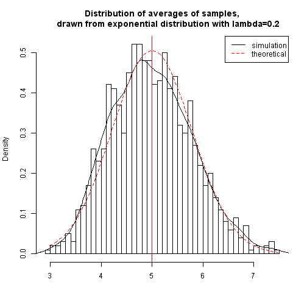
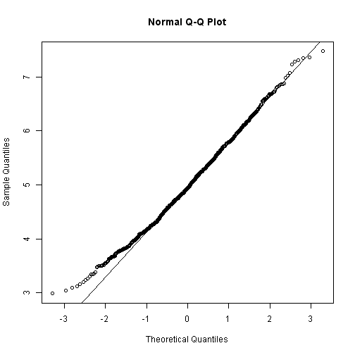
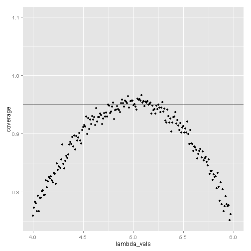

### Course Project Part 1
####Simulation with exponential distribution
The exponential distribution can be simulated in R with *rexp(n,lambda)* where lambda is the rate parameter. The mean of exponential distribution is *1/lambda* and the standard deviation is also *1/lambda*. In this simulation, we will investigate the distribution of averages of 40 exponential distributions, lambda=0.2.

Initially, we set:

```r
lambda <- 0.2
set.seed(3)
num_sim <- 1000 #how many simulations we will do
sample_size <- 40 #sample size 
#sim is a (num_sim*sample_size) matrix
sim <- matrix(rexp(num_sim*sample_size, rate=lambda), num_sim, sample_size)
row_means <- rowMeans(sim) #means of simulations
```
Now, we want to show

- where the distribution is centered at and compare it to the theoretical center of the distribution.
- how variable it is and compare it to the theoretical variance of the distribution.
- and that the distribution is approximately normal.

The distribution of sample means is centered at 4.98662 and the theoretical center of the distribution is 5.

```r
#sample means
mean(row_means)
```

```
## [1] 4.98662
```

```r
#theoretical
1/lambda
```

```
## [1] 5
```
The variance of sample means is 0.625 where the theoretical variance of the distribution is 0.6257575.

```r
#theoretical
sd <- (1/lambda)/sqrt(sample_size)
sd^2
```

```
## [1] 0.625
```

```r
#sample variance
var(row_means)
```

```
## [1] 0.6257575
```
Graphically, the distribution of sample means is as follows.

```r
# plot histogram of averages
hist(row_means, breaks=50, prob=TRUE,
     main="Distribution of averages of samples,
     drawn from exponential distribution with lambda=0.2",
     xlab="")
# density of the averages of samples
lines(density(row_means))
# theoretical center of distribution
abline(v=1/lambda, col="red")
# theoretical density of the averages of samples
xfit <- seq(min(row_means), max(row_means), length=100)
yfit <- dnorm(xfit, mean=1/lambda, sd=(1/lambda/sqrt(sample_size)))
lines(xfit, yfit, pch=22, col="red", lty=2)
# add legend
legend('topright', c("simulation", "theoretical"), lty=c(1,2), col=c("black", "red"))
```

 
Due to the CLT, the averages of samples follow normal distribution. The figure above also shows the density computed using the histogram and the normal density plotted with theoretical mean and variance values. The q-q plot below suggests normality.

```r
qqnorm(row_means)
qqline(row_means)
```

 
Now, we evaluate the coverage of the confidence interval for *lambda*:

X_hat ± ((1.96 * S)/ sqrt(n)).

```r
X_hat <- mean(row_means) + c(-1, 1) * 1.96 * sd(row_means)/sqrt(sample_size)
```


```r
#define a sequence of 1/lambda values near what we are estimating
lambda_vals <- seq(4, 6, by=0.01)

#coverage
set.seed(3)
coverage <- sapply(lambda_vals, function(lmbd) {
  #Calculate X_hats for a thousand of simulations 
  s <- matrix(rexp(num_sim*sample_size, rate=0.2), num_sim, sample_size)
  X_hats <- rowMeans(s) #means of simulations
  #calculate limits  
  lowerlimit <- X_hats - (qnorm(0.975) * (1/lambda)/sqrt(sample_size))
  upperlimit <- X_hats + (qnorm(0.975) * (1/lambda)/sqrt(sample_size))
  #calculate the proportion of times that they can cover
  #the true value of lambda used to simulate the data
  mean(lowerlimit < lmbd & upperlimit > lmbd)
  #sum(lmbd > lowerlimit & lmbd < upperlimit) / length(X_hats)
})

#plot
library(ggplot2)
qplot(lambda_vals, coverage) +
  geom_hline(yintercept=0.95)+ ylim(.75, 1.10)
```

 
The plot shows that, for an election of *lambda* close to 5, the average of the sample mean falls within the confidence interval at least 95% of the time. 
