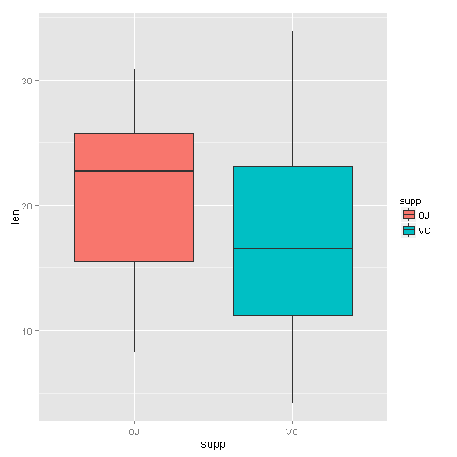

### Course Project Part 2
We are going to analyze the ToothGrowth data in the R datasets package.

- Load the ToothGrowth data and perform some basic exploratory data analyses.
- Provide a basic summary of the data.
- Use confidence intervals and hypothesis tests to compare tooth growth by supp and dose. (Use the techniques from class even if there's other approaches worth considering).
- State conclusions and the assumptions needed for those conclusions. 

#####Load and Know data

```r
data(ToothGrowth)
str(ToothGrowth)
```

```
## 'data.frame':	60 obs. of  3 variables:
##  $ len : num  4.2 11.5 7.3 5.8 6.4 10 11.2 11.2 5.2 7 ...
##  $ supp: Factor w/ 2 levels "OJ","VC": 2 2 2 2 2 2 2 2 2 2 ...
##  $ dose: num  0.5 0.5 0.5 0.5 0.5 0.5 0.5 0.5 0.5 0.5 ...
```

```r
head(ToothGrowth)
```

```
##    len supp dose
## 1  4.2   VC  0.5
## 2 11.5   VC  0.5
## 3  7.3   VC  0.5
## 4  5.8   VC  0.5
## 5  6.4   VC  0.5
## 6 10.0   VC  0.5
```

```r
tail(ToothGrowth)
```

```
##     len supp dose
## 55 24.8   OJ    2
## 56 30.9   OJ    2
## 57 26.4   OJ    2
## 58 27.3   OJ    2
## 59 29.4   OJ    2
## 60 23.0   OJ    2
```

```r
table(ToothGrowth$dose,ToothGrowth$supp)
```

```
##      
##       OJ VC
##   0.5 10 10
##   1   10 10
##   2   10 10
```

```r
library(ggplot2)
#ggplot(aes(x=dose, y=len), data=ToothGrowth) + geom_boxplot(aes(fill=dose))
# visualization of tooth growth as function of supplement type
ggplot(aes(x=supp, y=len), data=ToothGrowth) + geom_boxplot(aes(fill=supp))
```

 

#####Provide a basic summary of the data

```r
summary(ToothGrowth)
```

```
##       len        supp         dose      
##  Min.   : 4.20   OJ:30   Min.   :0.500  
##  1st Qu.:13.07   VC:30   1st Qu.:0.500  
##  Median :19.25           Median :1.000  
##  Mean   :18.81           Mean   :1.167  
##  3rd Qu.:25.27           3rd Qu.:2.000  
##  Max.   :33.90           Max.   :2.000
```

```r
summary(ToothGrowth[ToothGrowth$supp == "OJ",])
```

```
##       len        supp         dose      
##  Min.   : 8.20   OJ:30   Min.   :0.500  
##  1st Qu.:15.53   VC: 0   1st Qu.:0.500  
##  Median :22.70           Median :1.000  
##  Mean   :20.66           Mean   :1.167  
##  3rd Qu.:25.73           3rd Qu.:2.000  
##  Max.   :30.90           Max.   :2.000
```

```r
summary(ToothGrowth[ToothGrowth$supp == "VC",])
```

```
##       len        supp         dose      
##  Min.   : 4.20   OJ: 0   Min.   :0.500  
##  1st Qu.:11.20   VC:30   1st Qu.:0.500  
##  Median :16.50           Median :1.000  
##  Mean   :16.96           Mean   :1.167  
##  3rd Qu.:23.10           3rd Qu.:2.000  
##  Max.   :33.90           Max.   :2.000
```
#####Confidence Intervals and Hypothesis Testing
*Test by Supplement*

Null hypothesis: true difference in means is equal to 0.

Alternative hypothesis: true difference in means is not equal to 0.

```r
# check for group differences due to different supplement type 
# assuming unequal variances between the two groups
t.test(len ~ supp, data = ToothGrowth)
```

```
## 
## 	Welch Two Sample t-test
## 
## data:  len by supp
## t = 1.9153, df = 55.309, p-value = 0.06063
## alternative hypothesis: true difference in means is not equal to 0
## 95 percent confidence interval:
##  -0.1710156  7.5710156
## sample estimates:
## mean in group OJ mean in group VC 
##         20.66333         16.96333
```
The p-value is 0.06, and the confidence interval contains zero. This indicates that we can not reject the null hypothesis that the different supplement types have no effect on tooth length.

*Test by Dosage*

For these tests, we will ignore the the type of supplement, and see if there is a difference in tooth length based on dosage levels. We create three separate data frames to compare 0.5 vs 1.0, 0.5 vs 2.0, and 1.0 vs 2.0.

Null hypothesis: true difference in means is equal to 0.

Alternative hypothesis: true difference in means is not equal to 0.


```r
# first create three sub-groups as per dose level pairs
ToothGrowth.doses_0.5_1.0 <- subset (ToothGrowth, dose %in% c(0.5, 1.0)) 
ToothGrowth.doses_0.5_2.0 <- subset (ToothGrowth, dose %in% c(0.5, 2.0)) 
ToothGrowth.doses_1.0_2.0 <- subset (ToothGrowth, dose %in% c(1.0, 2.0)) 

# Check for group differences due to different dose levels (0.5, 1.0)
# assuming unequal variances between the two groups
t.test(len ~ dose, data = ToothGrowth.doses_0.5_1.0)
```

```
## 
## 	Welch Two Sample t-test
## 
## data:  len by dose
## t = -6.4766, df = 37.986, p-value = 1.268e-07
## alternative hypothesis: true difference in means is not equal to 0
## 95 percent confidence interval:
##  -11.983781  -6.276219
## sample estimates:
## mean in group 0.5   mean in group 1 
##            10.605            19.735
```

```r
# Check for group differences due to different dose levels (0.5, 2.0)
# assuming unequal variances between the two groups
t.test(len ~ dose, data = ToothGrowth.doses_0.5_2.0)
```

```
## 
## 	Welch Two Sample t-test
## 
## data:  len by dose
## t = -11.799, df = 36.883, p-value = 4.398e-14
## alternative hypothesis: true difference in means is not equal to 0
## 95 percent confidence interval:
##  -18.15617 -12.83383
## sample estimates:
## mean in group 0.5   mean in group 2 
##            10.605            26.100
```

```r
# Check for group differences due to different dose levels (1.0, 2.0)
# assuming unequal variances between the two groups
t.test(len ~ dose, data = ToothGrowth.doses_1.0_2.0)
```

```
## 
## 	Welch Two Sample t-test
## 
## data:  len by dose
## t = -4.9005, df = 37.101, p-value = 1.906e-05
## alternative hypothesis: true difference in means is not equal to 0
## 95 percent confidence interval:
##  -8.996481 -3.733519
## sample estimates:
## mean in group 1 mean in group 2 
##          19.735          26.100
```
For all three dose level pairs, the p-value is less than 0.05, and the confidence interval does not contain zero. The mean tooth length increases on raising the dose level. This indicates that we can reject the null hypothesis, and establishes that increasing the dose level leads to an increase in tooth length.
#####State your conclusions and the assumptions needed for your conclusions

*Conclusions*

- Supplement type has no effect on tooth growth.

- Increasing the dose level leads to increased tooth growth.

*Assumptions*

- The experiment was done with random assignment of guinea pigs to different dose level categories and supplement type to control for confounders that might affect the outcome.

- Members of the sample population (60 guinea pigs), are representative of the entire population of guinea pigs. This assumption allows us to generalize the results.

- For the t-tests, the variances are assumed to be different for the two groups being compared. This assumption is less stronger than the case in which the variances are assumed to be equal.
